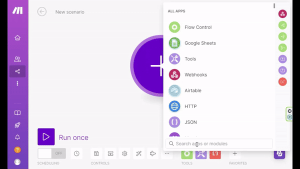

# Bookmark Webhook Trigger Extension

This Chrome extension triggers a predefined webhook whenever a bookmark or folder is created, updated, deleted, or moved. The webhook payload includes information about the bookmark or folder, including the parent folder path. You can configure the webhook URL and select which actions to trigger.

## Features

- Trigger a webhook on bookmark or folder creation, update, deletion, or move.
- Configurable webhook URL.
- Select which actions to trigger.
- Displays notifications on errors.

## Installation

1. Clone the repository or download the ZIP file and extract it.

   ```bash
   git clone https://github.com/yourusername/bookmark-webhook-trigger.git
   ```

2. Open Chrome and navigate to `chrome://extensions/`.

3. Enable "Developer mode" by toggling the switch in the top right corner.

4. Click on "Load unpacked" and select the directory where you cloned or extracted the extension.

## Configuration

1. Once the extension is installed, it will open the options page automatically.
2. Enter the webhook URL where you want to send the bookmark or folder data.
3. Select the actions you want to trigger the webhook (created, updated, deleted, moved).
4. Click "Save" to store the settings.

## Usage

The extension listens for bookmark and folder events and sends a POST request to the configured webhook URL with the following JSON payload:

### Sample Payload for Bookmark Created

```json
{
  "event": "created",
  "data": {
    "dateAdded": 1717358928132,
    "id": "63",
    "index": 13,
    "parentId": "1",
    "title": "Callinetic",
    "url": "https://www.callinetic.be/en",
    "folderPath": "/Bookmarks Bar",
    "parentFolder": "Bookmarks Bar"
  },
  "type": "bookmark"
}
```

### Sample Payload for Bookmark Updated

```json
{
  "event": "updated",
  "data": {
    "id": "63",
    "title": "Callinetic - Updated",
    "url": "https://www.callinetic.be/en"
  },
  "type": "bookmark"
}
```

### Sample Payload for Bookmark Moved

```json
{
  "event": "moved",
  "data": {
    "id": "63",
    "title": "Callinetic - Updated",
    "parentId": "33",
    "index": 1,
    "url": "https://www.callinetic.be/en",
    "folderPath": "/Bookmarks Bar/Make/Partners/Experts/",
    "parentFolder": "Experts"
  },
  "type": "bookmark"
}
```

### Sample Payload for Bookmark Deleted

```json
{
  "event": "deleted",
  "data": {
    "id": "63",
    "parentId": "33",
    "index": 1,
    "folderPath": "/Bookmarks Bar/Make/Partners/Experts/",
    "parentFolder": "Experts"
  },
  "type": "bookmark"
}
```

### Sample Payload for Folder Created

```json
{
  "event": "created",
  "data": {
    "dateAdded": 1717358960106,
    "dateGroupModified": 1717358960106,
    "id": "64",
    "index": 3,
    "parentId": "6",
    "title": "Make partner",
    "folderPath": "/Bookmarks Bar/Callinetic",
    "parentFolder": "Callinetic"
  },
  "type": "folder"
}
```

### Sample Payload for Folder Updated

```json
{
  "event": "updated",
  "data": {
    "id": "64",
    "title": "Expert Make partner"
  },
  "type": "folder"
}
```

### Sample Payload for Folder Moved

```json
{
  "event": "moved",
  "data": {
    "id": "64",
    "title": "Expert Make partner",
    "parentId": "11",
    "index": 8,
    "url": null,
    "folderPath": "/Bookmarks Bar/Make/Partners",
    "parentFolder": "Partners"
  },
  "type": "folder"
}
```

### Sample Payload for Folder Deleted

```json
{
  "event": "deleted",
  "data": {
    "id": "64",
    "parentId": "11",
    "index": 8,
    "folderPath": "/Bookmarks Bar/Make/Partners",
    "parentFolder": "Partners"
  },
  "type": "folder"
}
```

## Example Use Case with Make.com

[Make](https://www.make.com) allows you to create automation workflows. Here’s how you can use this extension to send bookmark events to a Make webhook:

> [!TIP]
> **Get Started with Make**:
> New users can get 10,000 free operations for the first month by signing up with this [affiliate link](https://www.make.com/en?pc=callinetic).

1. **Create a Webhook in Make**:
   - Log in to your Make account.
   - Create a new scenario.
   - Add a new module and search for "Webhook".
   - Select the "Custom Webhook" option.
   - Copy the provided webhook URL.
   - Start running your scenario by clicking the "Run Once" button.

2. **Configure the Extension**:
   - Open the extension's options page.
   - Paste the Make webhook URL into the webhook URL field.
   - Select the actions (created, updated, deleted, moved) you want to trigger the webhook.
   - Click "Save".

3. **Trigger an Event**:
   - Create, update, delete, or move a bookmark or folder in Chrome.
   - The extension will send a POST request to the Make webhook with the bookmark or folder data.

4. **Verify in Make**:
   - Go back to your scenario in Make.
   - You should see the webhook being triggered with the bookmark or folder data.
   - Use this data to perform further actions in your Make scenario (e.g., store the data in a Google Sheet, send a notification, etc.).



## Error Handling

If the extension fails to send the data to the webhook, it will display a Chrome notification with the error message.

## Development

To contribute to the development of this extension:

1. Fork the repository.
2. Create a new branch for your feature or bugfix.

   ```bash
   git checkout -b feature-name
   ```

3. Make your changes and commit them with descriptive messages.

   ```bash
   git commit -m "Description of the feature or bugfix"
   ```

4. Push your changes to your forked repository.

   ```bash
   git push origin feature-name
   ```

5. Create a pull request on the original repository.

## License

This project is licensed under the MIT License. See the [LICENSE](LICENSE) file for details.

## Acknowledgements

- This extension uses the [Tailwind CSS](https://tailwindcss.com/) framework for styling the options page.
- Icon generated using ChatGPT and DALL-E by OpenAI.
